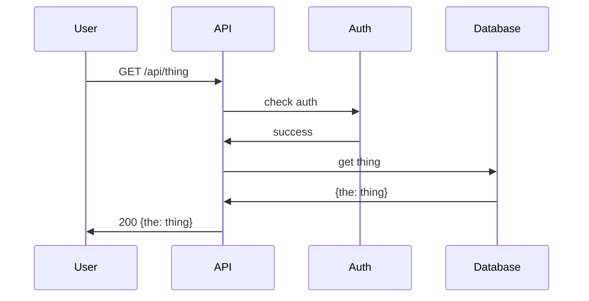

# github-tips

Useful tips &amp; tricks for GitHub. Mostly for me, but public so others might enjoy.

## :exploding_head: Wait wat?

1. Press `.` (period key) while browsing any repository or pull request on GitHub and it'll open that repo in the "web-based editor" [github.dev](https://github.com/features/codespaces). [(docs)](https://docs.github.com/en/codespaces/the-githubdev-web-based-editor)

## :astonished: Okay, that is awesome

1. Use the command palette in GitHub to navigate, search, and run commands directly from your keyboard. [(docs)](https://docs.github.com/en/get-started/using-github/github-command-palette)
   - `Command`+`K` or `Command`+`Option`+`K` (Mac) or
   - `Ctrl`+`K` or `Ctrl`+`Alt`+`K` (Windows/Linux)
2. You can specify the theme an image is displayed to by appending `#gh-dark-mode-only` or `#gh-light-mode-only` to the end of an image URL, in Markdown.

## :nerd_face: Ooh neat

1. Press `?` on any page in GitHub to see all available keyboard shortcuts.
2. When viewing a file on GitHub.com, you can press the `y` key to update the URL to a permalink to the exact version of the file you see. [(docs)](https://docs.github.com/en/repositories/working-with-files/using-files/getting-permanent-links-to-files)
3. Toggle between the Write and Preview tabs
   - `Command`+`Shift`+`P` (Mac) or
   - `Ctrl`+`Shift`+`P` (Windows/Linux)

## :slightly_smiling_face: Bro do you even GitHub?

> _Many of these are simply keyboard shortcuts I use a lot.  Check the [docs on GitHub](https://docs.github.com/en/get-started/using-github/keyboard-shortcuts) for many more._

1. When viewing a repo on GitHub you can switch between the Code, Issues, Pull Requests, Actions, etc. tabs by typing `G` and the first letter of the Tabs title.  For example, `G` `I` opens the issue tab, `G` `A` opens the Actions tab.
2. On the Code tab, `T` opens the file finder
3. On the Issues tab, typing `C` will create a new issue
4. When creating/editing an Issue, `A` allows you to set an assignee and `L` applies a label.

#### Example flow

A common example (for me) using several of the shortcuts above after landing on a repo page on GitHub:

1. `G` `I` to open the Issues tab
2. `C` to create a new issue
3. fill in title and description
4. `A` to assign someone
5. `L` to add labels

## Markdown

> _Check out the docs on [basic formatting syntax](https://docs.github.com/en/get-started/writing-on-github/getting-started-with-writing-and-formatting-on-github/basic-writing-and-formatting-syntax) for more info, these are just a few favorites_

1. [Emoji cheat sheet](https://github.com/ikatyang/emoji-cheat-sheet/blob/master/README.md)
2.  <details><summary>Create collapsed sections...</summary>
    <p>

     > Using the [`<details>`](https://docs.github.com/en/get-started/writing-on-github/working-with-advanced-formatting/organizing-information-with-collapsed-sections) tag

    #### We can hide anything, even headers
    ```ruby
    # or code
    puts "Hello World"
    ```

    </p>
    </details>
3. [Mermaid](https://mermaid-js.github.io/mermaid/#/) is freaking awesome for [flowcharts](https://mermaid-js.github.io/mermaid/#/./flowchart?id=flowcharts-basic-syntax), [sequence diagrams](https://mermaid-js.github.io/mermaid/#/./sequenceDiagram), [gantt diagrams](https://mermaid-js.github.io/mermaid/#/./gantt), [class diagrams](https://mermaid-js.github.io/mermaid/#/./classDiagram), and more

4. aand... footnotes with simple bracket syntax[^1], or named[^note].

[^1]: My reference.
[^note]:
    Named footnotes will still render with numbers instead of the text but allow easier identification and linking.
    This footnote also has been made with a different syntax using 4 spaces for new lines.
